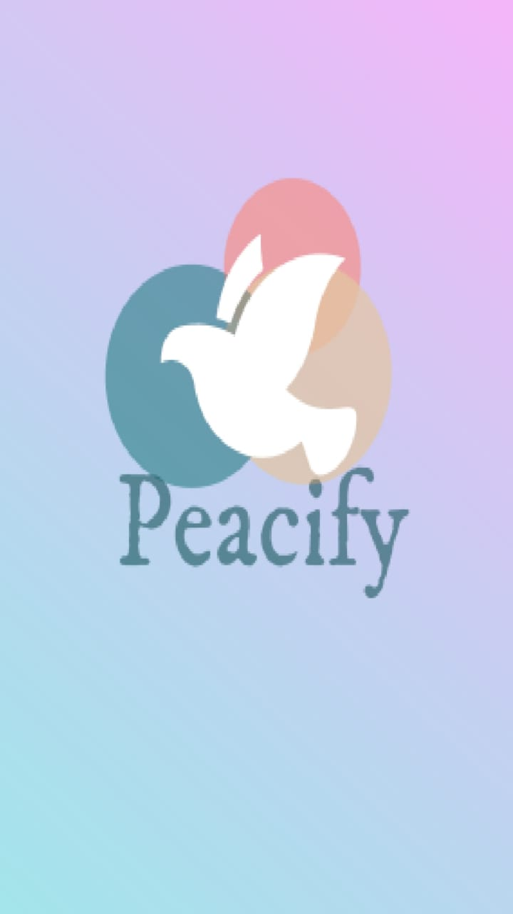
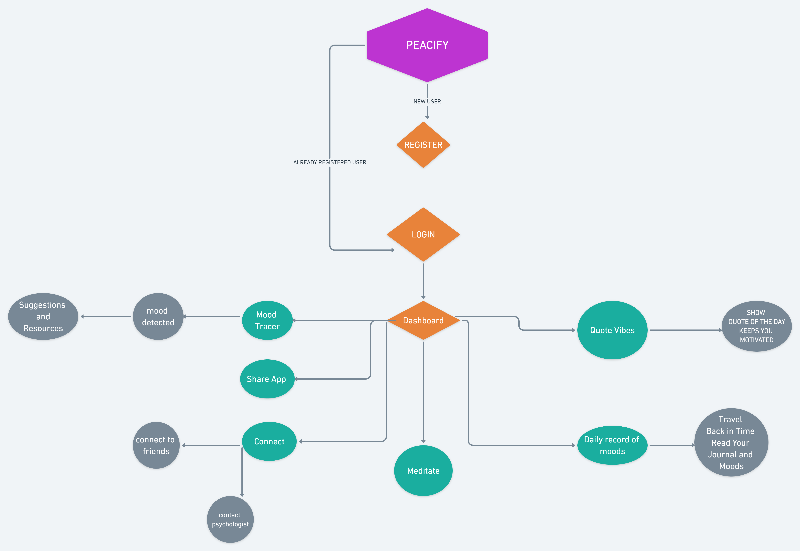

# SheHacks_Team-013 : PEACIFY 

<!-- <div class="container-fluid">
  
</div> -->


<!-- TABLE OF CONTENTS -->
<details open="open">
  <summary>Table of Contents</summary>
  <ol>
     <li>
      <a href="#about-the-project">About PEACIFY</a>
    </li>
    <li>
      <a href="#getting-started">Flowchart</a>
    </li>
    <li><a href="#requirements">Requirements </a></li>
    <li><a href="#installation-instructions"> Installation Instructions</a></li>
    <li><a href="#inspiration">What was our inspiration for 'Peacify' ?</a></li>
    <li><a href="#challenges">What Challenges did we run into?</a></li>
    <li><a href="#more-features">If we had more time, what more features would we add to this project ?</a></li>
    <li><a href="#accomplishments">What Accomplishments are we most proud of and what did we learn?</a></li>
    <li><a href="#Tech-stack">Tech stack</a></li>
    <li><a href="#team">Team</a></li>
    <li><a href="#license">License</a></li>
  </ol>
</details>


<!-- ABOUT THE PROJECT -->
## 🎯About PEACIFY 


* “Peacify” functions to stabilise and take care of our mental health. It takes the input of how the user is feeling via MoodTracer  based upon his current feelings like sad, happy , crying , anxious and much more.:kissing::grin::confounded::sob: 
* The most interesting work performed by Peacify is “Journal Work” , where we can write whatever we want to, maybe the feelings, or what happened throughout the day, what makes that day  feel to the user.
* Based upon the input of the user, Peacify makes suggestions :pushpin: to the user about what he should do right then when he is feeling low , depressed or any such feeling.
* Peacify has a beautiful feature of Meditation with background guiding music for making him Relax and more peaceful.
* Peacify is associated with :bookmark_tabs::clipboard: JournalActivity, hence it is a new feature over handwritten Diary/ Journal Writings making it more user friendly and portable to access any day’s happenings and feelings whenever he wishes to travel back in time.
* It has a feature of Sharing the app because “Sharing is Caring”
* It keeps the user motivated daily via Quotes Functionality that kick starts your day and mood , provokes his daily activity making him pro-active throughout the day.
* It gives a wonderful feature of getting help via contacting a friend when you want to talk with someone.In case of scenarios of Professional Help required, it gives the user the Nearest Therapist/ Psychiatrist Location via google maps and all the details required via the shortest 

<table>
  <tr>
    <td align="center"></td>
     <td align="center"></td>
 </tr>
</table>


<!-- DEMO -->
## Demo for PEACIFY :loudspeaker: :loudspeaker:
Ready Steady Go... :turtle: :rabbit2:
<br>
[CLICK HERE FOR DEMO](https://www.youtube.com/watch?v=Kj8oRTNniPU)

<!-- FLOWCHART -->
## FLOWCHART 


<!-- REQUIREMENTS -->
## REQUIREMENTS
``` Android Studio with 4.2 Beta Version```

<!-- INSTALLATION INSTRUCTIONS -->

## INSTALLATION GUIDE
``` 
fork the repo
git clone [REPO_URL]
run the app on Android Studio Beta 4.2  
``` 


<!-- INSPIRATION FOR PEACIFY -->

## 🤩What was our inspiration for 'Peacify' ?
* COVID-19 has impacted the lives of people around the world including children and adolescents in an unprecedented manner.In this backdrop one of the principal measures taken during lockdown has been closure of schools, educational institutes and activity areas. People started working from Home out of which the majority ones were IT Professionals . It becomes really tough to manage when it comes to working alone ,with such tiring work , which becomes a major reason neglecting health, especially mental wellness, gets affected. These inexorable circumstances which are beyond normal experience, lead to stress, anxiety and a feeling of helplessness in all.It has been indicated that compared to adults, this pandemic may continue to have increased long term adverse consequences on children and adolescents. We were also one of its victims , the effect of Online Semester , Virtual Meetups, Online Classes and then loads of work to be done alone amidst such an unprecedented atmosphere.

* Unfortunately, the nationwide closures of schools and colleges have negatively impacted   over 91% of the world's student population. Absence of structured setting of the school for a long duration result in disruption in routine, boredom and lack of innovative ideas for engaging in various academic and extracurricular activities. Some children have expressed lower levels of affect for not being able to play outdoors, not meeting friends and not engaging in the in-person school activities .During lockdown we came across various cases of depression and there were also many suicide cases reported during lockdown. Sometimes even we also felt overwhelmed by emotions as it was also hard on us living away from our college friends and we are still going through the phase of online semester which has challenges of its own. 

* Hence, came up the idea of Peacify , which caters to the needs of our in person growth 
, emotional growth , promoting more of self realization , tracking our own feeling of mood, how we do feel , prevents us from having that hollow feeling inside us , encourages us daily , motivates us to start our day better than the previous one making us more closer to ourselves by the Power of Meditation. Making our Lockdown at our respective homes more fruitful , more of growth , more of getting connected with yourself.


<!-- CHALLENGES FACED -->
## ⭐What Challenges did we run into?
* Since we had only basic knowledge of android studio , it was our first complete app , where we got bugs , googled , learnt <br>
``` Got Bugs ?  , Google !! , Repeat  ``` was the major thing we learnt.

* The major challenge was dealing with the dynamic database of the app. The Journal Part was the trickiest part to handle to fetch from one activity , send to another , save it in a journal , and then finally you can save all your previous journal entries from the database.


<!-- MORE FEATURES ADDITION -->
## 💁If we had more time, what more features would we add to this project ?

* To identify the mood of the User by the words its entering particularly using the Machine Learning algorithms for Sentiment Analysis . This feature can be added to the part of Mood Tracer where the User enters about his day ,all his feelings about the day, and use these statistics to train a model detecting chances of him to need mental assistance from any friend or psychologist.
* To include more features that involve the user in physical activities like walking by adding the feature of a pedometer and making him evolve his physical strength step by step. Since, it's a fact that physical exercises make us feel light  and away from anxiety, tensions, sadness ,low and depression.
* To include the feature of notifying the closest and the favourite friends of the user whom he would have specified on registering over Peacify. This feature of notifying when the user is sad , feeling low , depressed, etc.


<!-- ACCOMPLISHMENTS -->
## What Accomplishments:rocket: are we most proud of and what did we learn?

* We are proud of making this app that will benefit each one of us in these hard pandemic times to improve our quality of life in everything gone virtual which is directly or indirectly affecting our mental health.
* Writing about positive emotions may help to reduce stress and anxiety, according to our new study, published in the British Journal of Health Psychology. Earlier research has also found that writing about negative emotions – getting things “off your chest” – can improve your mental health.Hence, we are proud to accomplish this feature of “Writing and Journaling of our Whole Day feelings” , helping in self realisation and avoiding mood swings is the most interesting part of our project.:tada::tada:
* Being a beginner in Android Development , and making this app with just too astonishing features makes us more accomplished. The way our team work have accomplished in Unity and cooperation have worked out to be just another 8th Wonder Experience to keep each other motivated and always draw a helping hand while working on this application. 

<!-- TECH STACK -->
## TECH STACK :rocket::rocket:
* Java
* XML
* Firebase

<!-- TEAM -->
## TEAM :rainbow:

<table>
  <tr>
     <td align="center"><a href="https://github.com/medhabalani"><br /><sub><b>Medha</b></sub></a><br /></td>
     <td align="center"><a href="https://github.com/vidushi1012"><br /><sub><b>Vidushi</b></sub></a><br /></td>
    <td align="center"><a href="https://github.com/xxx32"><br /><sub><b>Aarushi</b></sub></a><br /></td>
     <td align="center"><a href="https://github.com/Jyotika999"><br /><sub><b>Jyotika</b></sub></a><br /></td>
 
 </tr>
</table>


<!-- contact -->
## Contact Us :telephone_receiver:


This site is a collaboration project of :mortar_board::mortar_board: JYOTIKA, VIDUSHI, MEDHA and AARUSHI, the students of IIIT Allahabad. We would be happy to help you in any way. Please feel free to reach out to us on any of the social media platform or mail for any kind of query. Details of all are given below:-


* [](mailto:IIT2019021@iiita.ac.in)<span> Medha</span>
* [](mailto:IIT2019027@iiita.ac.in)<span> Vidushi</span>
* [](mailto:IIT2019032@iiita.ac.in)<span> Aarushi</span>
* [](mailto:IIT2019036@iiita.ac.in)<span> Jyotika</span>


<!-- LICENSE -->
## License

Distributed under the APACHE License. See `LICENSE` for more information.

## Thanks for visiting our repository
Show some :heart: by starring :star: this repository .


